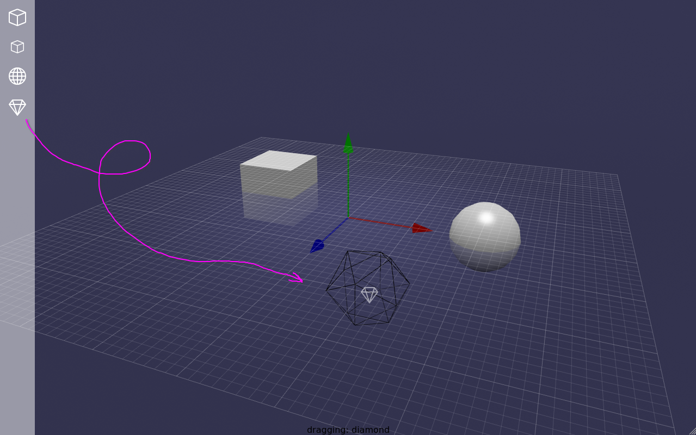

# BabylonJS snippets

My snippets and solutions for [BabylonJS](https://babylonjs.com/).

The code exploits modern web-components approach with [Lit library](https://lit.dev/) and [Modern Web toolchain](https://modern-web.dev/)

---- 

Solution for drag'n'drop from HTML UI to 3D scene with informed gizmo.

